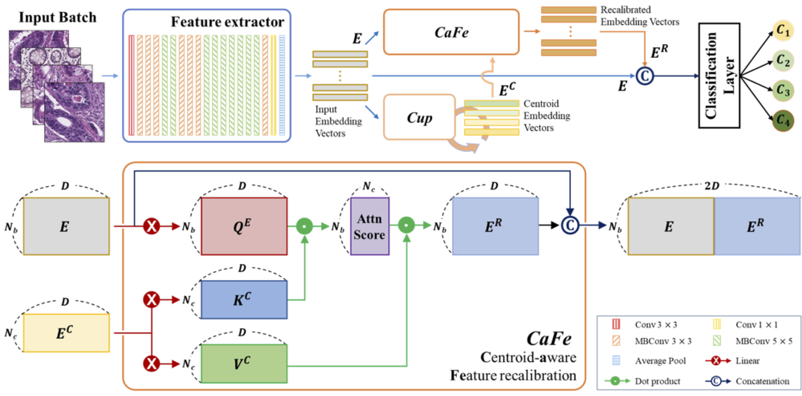

# CaFe-Net : Centroid-aware feature recalibration for cancer grading in pathology images
by Jaeung Lee, Keunho Byeon, and Jin Tae Kwak.

## Introduction
This repository is for our MICCAI 2023 paper: \
Centroid-aware feature recalibration for cancer grading in pathology images 
[[paper link]](https://arxiv.org/pdf/2307.13947.pdf)




CaFe-Net is a network designed to enhance the cancer grades classification in pathological images. 
The proposed network maps input pathological images into an embedding space and adjusts them using an attention 
mechanism with centroid embedding vectors of various cancer grades. With re-calibrated embedding vectors, 
the proposed network classifies input pathological images into relevant class labels, i.e., cancer grades.

## Datasets
All the models in this project were evaluated on the following datasets:

- [Colon_KBSMC](https://github.com/QuIIL/KBSMC_colon_cancer_grading_dataset) (Colon TMA from Kangbuk Samsung Hospital)
- [Colon_KBSMC](https://github.com/QuIIL/KBSMC_colon_cancer_grading_dataset) (Colon WSI from Kangbuk Samsung Hospital)

## Set Up Environment

```
conda env create -file environment.yml
conda activate CaFeNet
```

## Repository Structure
Below are the main directories in the repository:
- `data/`: datasets and figures used in the repo
- `utils/`: utils that are
- `model_lib/`: model definition

Below are the main executable scripts in the repository:
- `config.py`: configuration file
- `dataprepare.py`: data loader file
- `tester_CaFeNet.py`: evalution-only script
- `trainer_CaFeNet.py`: main training script


Details of data folder
1. Clone the dataset and set up the folders in the following structure:
```
 └─ data 
    └─ colon
       ├─ KBSMC_colon_tma_cancer_grading_1024
       |   ├─ 1010711
       |   ├─ ...
       |   └─ wsi_00018
       └─ KBSMC_colon_45wsis_cancer_grading_512 (Test 2)
           ├─ wsi_001
           ├─ ...
           └─ wsi_100
```

# Running the Code

## Training and Options
 
```
  python trainer_CaFeNet.py [--gpu=<id>] [--wandb_id=<your wandb id>] [--wandb_key=<your wandb key>]
```
## Inference

```
  python tester_CaFeNet.py [--gpu=<id>] [--wandb_id=<your wandb id>] [--wandb_key=<your wandb key> [--pretrained_weight=<True>]]
```

### Model Weights

Model weights obtained from training CaFe-Net here:
- [Colon checkpoint](https://github.com/colin19950703/CaFeNet/tree/main/pretrained)

If any of the above checkpoints are used, please ensure to cite the corresponding paper.

## Citation
If CaFe-Net is useful for your research, please consider citing the following paper <br />

BibTex entry: <br />
```
@inproceedings{lee2023centroid,
  title={Centroid-aware feature recalibration for cancer grading in pathology images},
  author={Lee, Jaeung and Byeon, Keunho and Kwak, Jin Tae},
  booktitle={International Conference on Medical Image Computing and Computer-Assisted Intervention},
  pages={212--221},
  year={2023},
  organization={Springer}
}
```
